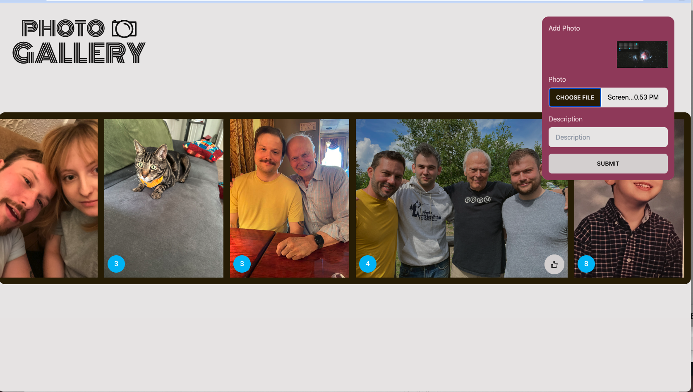

# Image Gallery


## Description

A gallery of my friends and family. Users can like, delete, and upload their own photos.


## Screenshots




## Run Locally

Clone the project

```bash
  git clone https://github.com/michael-duren/weekend-gallery.git
```

Go to the project directory

```bash
  cd weekend-gallery
```

Install dependencies

```bash
  npm install
```

Copy `server/database.sql` script into your PostgreSQL editor of choice

Start the server

```bash
  npm run server
```
Start the client

```bash
  npm run client
```
